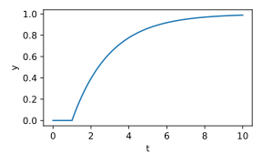
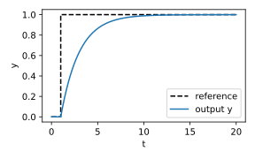

# CasADi Dynamic Models

Tools to define and manipulate simple linear dynamic models in [CasADi](https://web.casadi.org)
for use in non-linear dynamic modelling and optimization.  The models may have symbolic 
parameters allowing them to be included in optimization problems.

While CasADi is primarily used for solving non-linear optimization problems, it is often 
convenient to add linear dynamical systems to introduce simple identifiable dynamics.

Furthermore, it is sometimes necessary or convenient to use non-linear constrained optimization
to identify the parameters of linear dynamic models.

I'm not aware of a system identification toolbox for CasADi models so I developed these
tools to identify and simulate simple dynamical systems for my projects.

Note this is a work-in-progress and only a small subset of possible models have been
implemented.

## Examples: Building Models

```python
from cas_models.continuous_time.models import (
    StateSpaceModelCT, SSModelCTLinearFOSISO, SSModelCTLinearO2NoGainSISO
)
from cas_models.transformations import connect_systems_in_series

# First order, single-input, single-output, continuous-time
# state-space model with symbolic parameters
sys_model = SSModelCTLinearFOSISO()
print(sys_model.f)
print(sys_model.h)
```
```lang-none
f:(t,x,u,K,T1)->(rhs) SXFunction
h:(t,x,u,K,T1)->(y) SXFunction
```

Alternatively, some or all model parameters can be set to constants.
```python
# First order SISO system with fixed gain
sys_model = SSModelCTLinearFOSISO(K=2.5)
print(sys_model.f)
print(sys_model.h)
```
```lang-none
f:(t,x,u,T1)->(rhs) SXFunction
h:(t,x,u,T1)->(y) SXFunction
```

```python
# Second-order system with gain = 1
sys_model_2 = SSModelCTLinearO2NoGainSISO()
print(sys_model_2.f)
print(sys_model_2.h)
```
```lang-none
f:(t,x[2],u,T1,T2)->(rhs[2]) SXFunction
h:(t,x[2],u,T1,T2)->(y) SXFunction
```

```python
# Combine both systems by connecting in series
sys = connect_systems_in_series([sys_model, sys_model_2], model_class=StateSpaceModelCT)
print(sys.f)
print(sys.h)
```
```lang-none
f:(t,x[3],u,sys1_T1,sys2_T1,T2)->(rhs[3]) SXFunction
h:(t,x[3],u,sys1_T1,sys2_T1,T2)->(y) SXFunction
```

```python
# Series connections can also be made with the '*' operator
sys = sys_model * sys_model_2
```

## Examples: Simulation

```python
import numpy as np
import matplotlib.pyplot as plt

from cas_models.continuous_time.models import SSModelCTLinearFOSISO
from cas_models.discrete_time.models import StateSpaceModelDTFromCT
from cas_models.discrete_time.simulate import make_n_step_simulation_function_from_model

# Continuous time model
sys_ct = SSModelCTLinearFOSISO(K=1, T1=2)

# Convert to discrete-time with dt=0.1
dt = 0.1
sys_dt = StateSpaceModelDTFromCT(sys_ct, dt)
print(sys_dt.F)
print(sys_dt.H)
```
```lang-none
F:(t,xk,uk)->(xkp1) SXFunction
H:(t,xk,uk)->(yk) SXFunction
```

```python
# Number of time-steps to simulate
nT = 100
simulate = make_n_step_simulation_function_from_model(sys_dt, nT)
print(simulate)
```
```lang-none
F_sim_100_steps:(t_eval[101],U[100],x0)->(X[101],Y[101]) SXFunction
```

```python
# Simulation time
# Note: Simulation outputs include values for nT+1 time instants
t = dt * np.arange(nT + 1)
t_in = t[:-1]

# Simulation inputs
U = np.zeros((nT, 1))
U[t_in >= 1] = 1.0

# Initial condition
x0 = np.zeros(sys_dt.n)
X, Y = simulate(t, U, x0)

assert X.shape == (nT + 1, sys_dt.n)  # states
assert Y.shape == (nT + 1, sys_dt.ny)  # outputs
```


```python
# Make time-series plot
fig, ax = plt.subplots(figsize=(4, 2.5))
ax.plot(t, Y[:, 0])
ax.set_xlabel("t")
ax.set_ylabel("y")
ax.grid(False)
plt.tight_layout()
plt.show()
```


## Examples: Simulating a Feedback Loop

```python
from cas_models.continuous_time.regulators import SSModelCTPIInt
from cas_models.transformations import connect_feedback_system

# First-order plant: G(s) = 1 / (2s + 1)
plant = SSModelCTLinearFOSISO(K=1, T1=2, name="plant")

# PI controller in interactive form: Gc(s) = Kc * (Ti*s + 1) / (Ti*s)
ctrl = SSModelCTPIInt(Kc=1, Ti=2, name="ctrl")
```

```python
# Negative feedback loop: reference -> ctrl -> plant -> (feedback) -> ctrl
sys1 = ctrl * plant
print(sys1.name, sys1.input_names, sys1.output_names)
```
```lang-none
ctrl_plant ['e'] ['y']
```

```python
sys_cl = connect_feedback_system(sys1, model_class=StateSpaceModelCT)
print(f"Inputs:  {sys_cl.input_names}")
print(f"Outputs: {sys_cl.output_names}")
print(f"States:  {sys_cl.state_names}")
```
```lang-none
Inputs:  ['y_sp']
Outputs: ['y']
States:  ['plant_x', 'ctrl_x']
```

```python
# Convert to discrete-time and simulate step response
dt = 0.1
sys_cl_dt = StateSpaceModelDTFromCT(sys_cl, dt)

nT = 200
simulate_cl = make_n_step_simulation_function_from_model(sys_cl_dt, nT)

t = dt * np.arange(nT + 1)
R_full = np.where(t >= 1, 1.0, 0.0)      # reference at all nT+1 time instants
R = R_full[:-1].reshape(-1, 1)            # inputs at nT steps

x0 = np.zeros(sys_cl_dt.n)
X, Y = simulate_cl(t, R, x0)

assert X.shape == (nT + 1, sys_cl_dt.n)
assert Y.shape == (nT + 1, sys_cl_dt.ny)
```

```python
fig, ax = plt.subplots(figsize=(4, 2.5))
ax.step(t, R_full, "k--", where="post", label="reference")
ax.plot(t, Y[:, 0], label="output y")
ax.set_xlabel("t")
ax.set_ylabel("y")
ax.legend()
plt.tight_layout()
plt.show()
```

